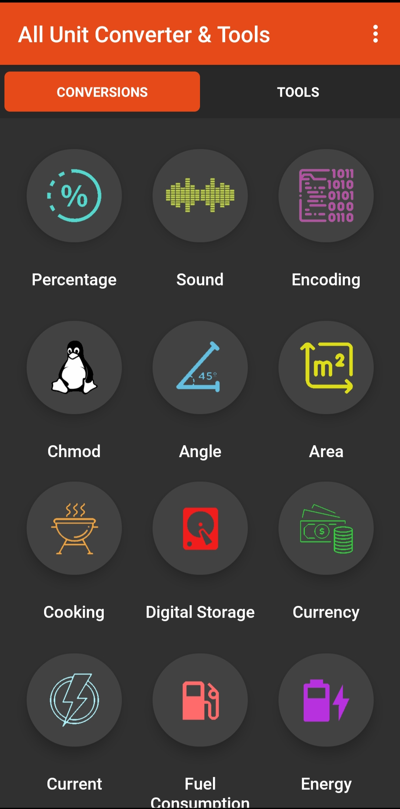
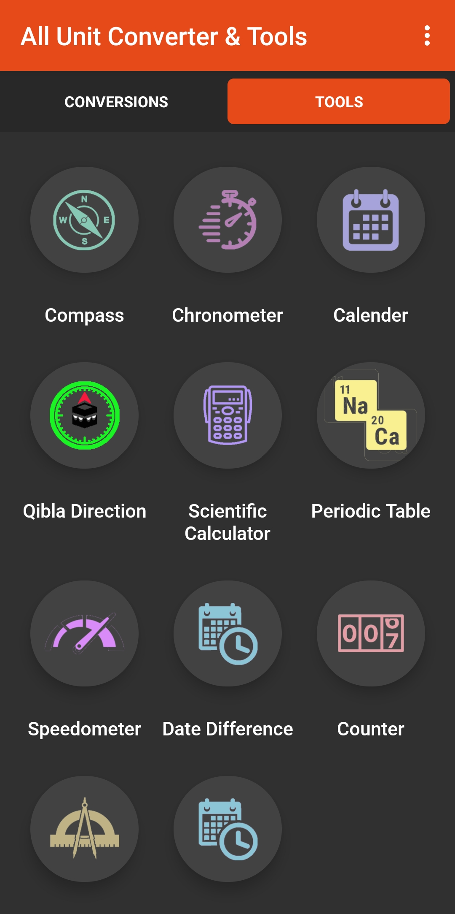

# Task 5: Webdriver, Appium, Browserstack

## App

https://play.google.com/store/apps/details?id=com.digitalindeed.converter

#### Clone repository:

    git clone https://github.com/radomyr-horban/wdio-appium.git

#### Install dependencies:

    npm ci

## Requirments:

- Install Java latest via https://www.java.com/ru/download/manual.jsp
- Set the environment variable called `JAVA_HOME` to the jre directory (C:\Program Files\Android\Android Studio\jre\)
- Install Node v16+ https://nodejs.org/en
- Install the latest Android Studio version https://developer.android.com/studio
- Add `ANDROID_HOME` to path in OS system variables
- Install Appium by command: `npm install -g appium`
- Install Appium inspector v2+ https://github.com/appium/appium-inspector/releases
- Install `uiautomator2` Appium driver by command: `appium driver install uiautomator2`
- plugged in any android device into your computer. Leave it unlocked.
- allowed USB-Debugging on the connected android device
- run `adb devices` to check device name( device id )
- set the platform version, device name and path to apps(apk/ipa) inside android config (config/wdio.adndroid.conf.js) to the version on your android device.
- run `appium` in cmd
- now you can interact with your apps through the appium inspector on your PC

## Setup with Browserstack

- Create `.env` file with the next variables:
  - `BROWSERSTACK_USERNAME`
  - `BROWSERSTACK_ACCESS_KEY`
  - `BROWSERSTACK_ANDROID_APP_ID`
  - `BROWSERSTACK_IOS_APP_ID`
- Sign in on the `browserstack` website (https://www.browserstack.com/) and upload your mobile apps (.apk and .ipa)
- Update `.env` file

## Commands

### Start the appium server:

    appium

### Run the android tests on windows:

    npm run test:android

### Run the ios tests:

    npm run test:ios

### Run the android tests on browserstack:

    npm run test:android:bs

### Run the ios tests on browserstack:

    npm run test:ios:bs

## Test structure

All test cases should be coded inside the `test` folder. There you can organize tests for different apps (e.g. msb-app) and define generic classes with getters and setters to use classes those methods inside other classes.

We work with the Page Object Pattern described in <https://webdriver.io/docs/pageobjects.html>. The main idea is to encapsulate logic into page classes and use the logic in the spec files to run the tests.

## App interface

